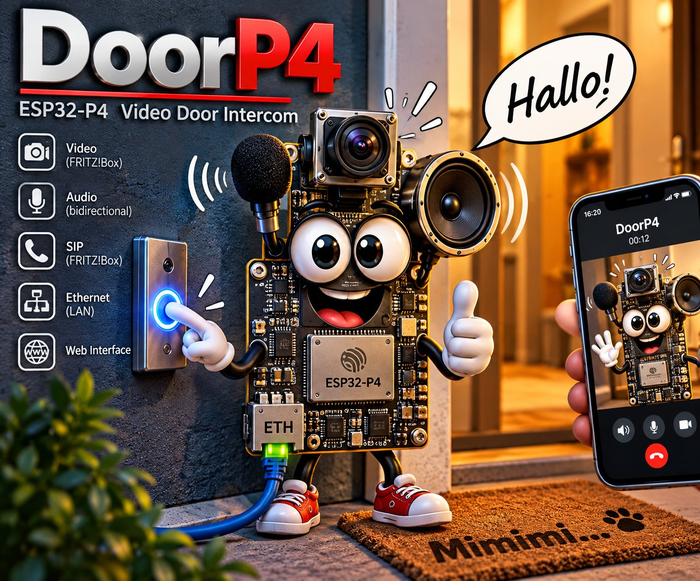
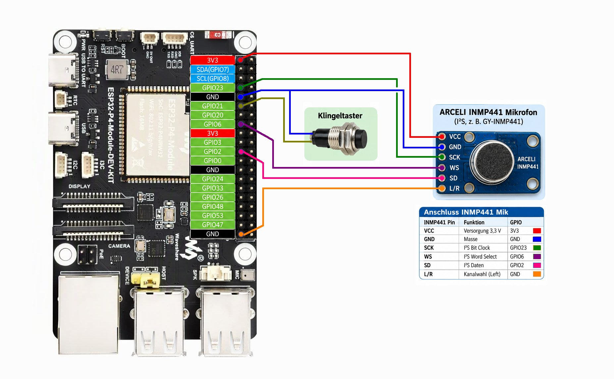

# DoorP4 – ESP32-P4 Video SIP Door Intercom

**Current release V1.02a provides SIP audio. Video support is planned using an external IP camera integrated via the FRITZ!Box. The ESP32-P4 camera interface is currently not used and can be added as an optional extension.**

DoorP4 is an experimental SIP door intercom based on the ESP32-P4.

## Current status

The current version **V1.02a** provides:

- Ethernet connectivity
- SIP registration with a FRITZ!Box
- Doorbell button handling
- SIP call setup
- Bidirectional audio
- INMP441 microphone input
- ES8311 audio output
- G.711 A-law (PCMA) audio over RTP
- Simple web interface

## Hardware

Current development platform:

- Waveshare ESP32-P4 Module-DEV-KIT
- INMP441 microphone
- ES8311 audio codec / speaker output
- Ethernet connection

Detailed FRITZ!Box setup guide:
See DoorP4_FRITZBox_Configuration.pdf for the complete step-by-step configuration with screenshots.

## Project status

DoorP4 is already running as a functional SIP door intercom with bidirectional audio.

This is the first public version of the project. Documentation, configuration instructions, hardware details and further development will follow.

More to come.
